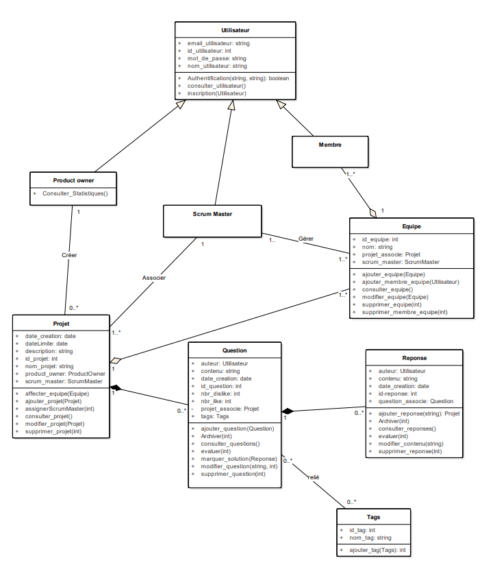
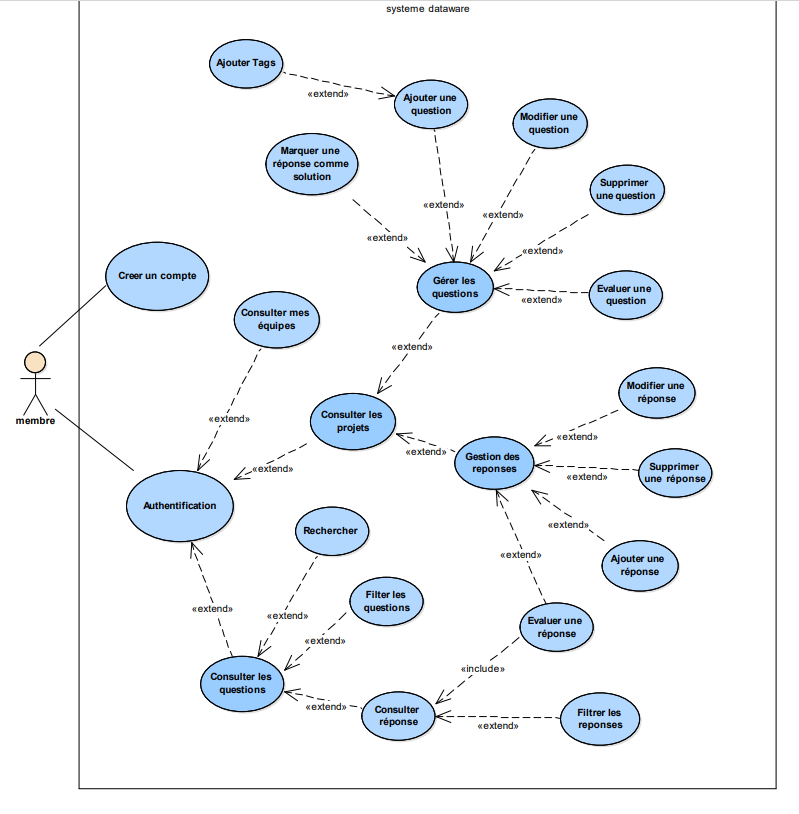
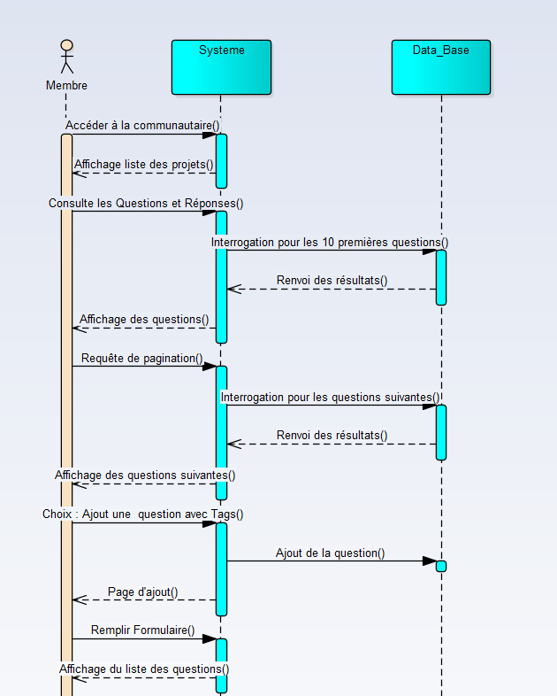

# 🚀 Présentation du Projet

Le client DataWare a exprimé le besoin d'intégrer une section communautaire à leur plateforme, similaire à 'Stack Overflow', dans le but de favoriser l'échange et l'entraide entre les membres de l'équipe. Notre mission consiste à développer cette extension en utilisant les langages PHP, SQL, JS, HTML, ainsi que des frameworks CSS tailwind.

## 🌟 Fonctionnalités Principales

### Authentification et Accès
- Les utilisateurs peuvent accéder à la section communautaire après une authentification.

### Navigation
- Les utilisateurs peuvent parcourir les différentes questions et réponses triées par date.
- En cliquant sur un projet, ils peuvent afficher les questions et réponses associées.

### Interface Utilisateur
- La pagination (utilisant AJAX) permet aux utilisateurs de visualiser 10 questions par page.
- Les utilisateurs peuvent poser des questions liées à un projet spécifique.
- Possibilité de modifier ou supprimer ses propres questions avec suppression en cascade.

### Tags et Recherche
- Les utilisateurs peuvent insérer plusieurs tags à la fois pour une recherche facilitée (insertion en masse).
- Recherche de questions par titre, tags (bonus) ou contenu.

### Interaction et Gestion des Réponses
- Les utilisateurs peuvent répondre à une question existante.
- Modification ou suppression des propres réponses avec suppression en cascade.
- Marquage d'une réponse comme solution à une question.

### Fonctions Avancées
- Les Scrum Masters peuvent archiver une question ou une réponse inappropriée.

### Évaluation et Analytiques
- Les utilisateurs peuvent évaluer une question ou une réponse (j'aime ou je n'aime pas).
- Consultation du nombre de j'aimes ou je n'aime pas pour chaque réponse.
- Les Product Owners peuvent consulter le nombre de questions par projet, les projets avec le plus de questions, le projet avec le moins de réponses, et l'utilisateur avec le plus de réponses.

## 🎨 Conception du Projet

### Diagrammes UML

1. **Diagramme de Cas d'Utilisation:**
   - Illustrant les interactions entre les acteurs et le système, détaillant les fonctionnalités offertes.
   - 

2. **Diagramme de Classes:**
   - Présentant les classes du système, leurs attributs et relations pour une vision structurée du code.
   - 

3. **Diagramme de Séquence:**
   - Décrivant la séquence des interactions entre les objets pour des scénarios spécifiques. 🖼️ (path/to/image3.png)
   - 

## 💻 Technologies Utilisées

- Langages :
  - PHP 🐘
  - SQL 🗃️
  - JS 🌐
  - HTML 📄
- Frameworks : CSS (Tailwind) 🎨

## 📁 Structure du Projet

La structure des dossiers est organisée de manière à garantir une gestion efficace du code source. Pour plus de détails, veuillez vous référer à la documentation de la structure des dossiers.

## 🛢️ Schéma de la Base de Données

Un schéma visuel de la base de données est fourni dans le dossier 'Database'.

## 📄 Licence

Ce projet est distribué sous la licence [nom de la licence]. Consultez le fichier 'LICENSE.md' pour plus de détails.

